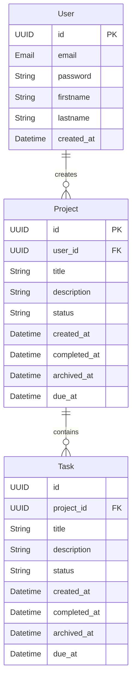

```mermaid
erDiagram
    User {
    UUID id PK
    Email email
    String password
    String firstname
    String lastname
    Datetime created_at
    }
    Project {
    UUID id PK
    UUID user_id FK
    String title
    String description
    String status
    Datetime created_at
    Datetime completed_at
    Datetime archived_at
    Datetime due_at
    }
    Task {
    UUID id
    UUID project_id FK
    String title
    String description
    String status
    Datetime created_at
    Datetime completed_at
    Datetime archived_at
    Datetime due_at
    }

    User 1 to 0+ Project: creates
    Project 1 to 0+ Task: contains
```
