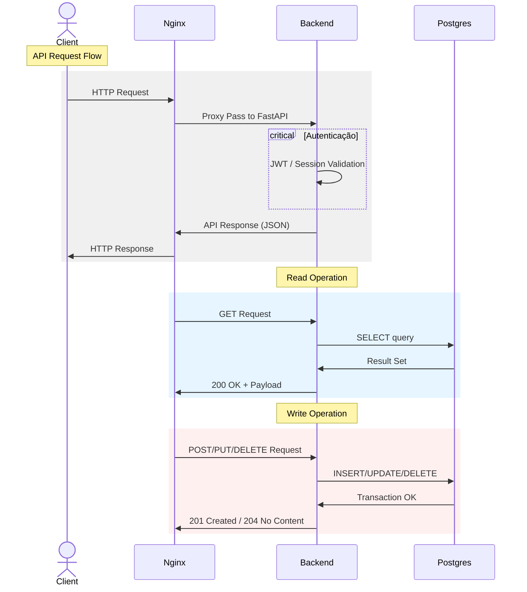
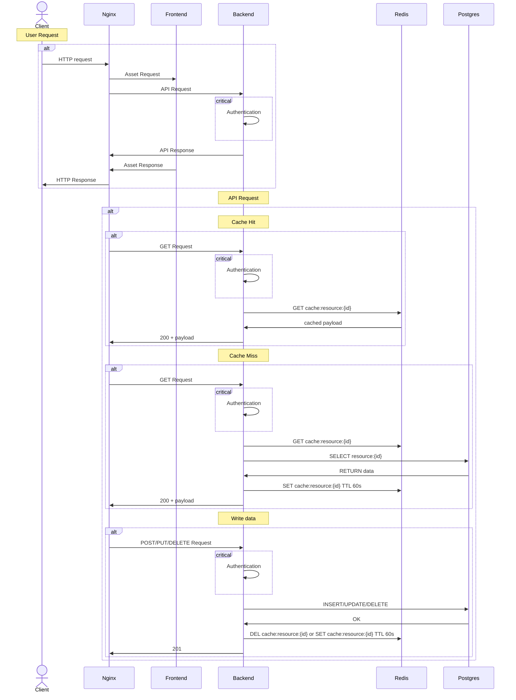

# Implementado

```mermaid
sequenceDiagram
    actor Client
    participant Nginx
    participant Backend
    participant Postgres

    note over Client: API Request Flow
    rect rgb(240, 240, 240)
        Client->>Nginx: HTTP Request
        Nginx->>Backend: Proxy Pass to FastAPI
        critical Autenticação
            Backend->>Backend: JWT / Session Validation
        end
        Backend->>Nginx: API Response (JSON)
        Nginx->>Client: HTTP Response
    end

    note over Backend: Read Operation
    rect rgb(230, 245, 255)
        Nginx->>Backend: GET Request
        Backend->>Postgres: SELECT query
        Postgres->>Backend: Result Set
        Backend->>Nginx: 200 OK + Payload
    end

    note over Backend: Write Operation
    rect rgb(255, 240, 240)
        Nginx->>Backend: POST/PUT/DELETE Request
        Backend->>Postgres: INSERT/UPDATE/DELETE
        Postgres->>Backend: Transaction OK
        Backend->>Nginx: 201 Created / 204 No Content
    end
```

# A implementar

```mermaid
sequenceDiagram
    actor Client
    participant Nginx
    participant Frontend
    participant Backend
    participant Redis
    participant Postgres

    %% User Request (Summary)

    note over Client: User Request
    alt
    Client->>Nginx: HTTP request
    Nginx->>Frontend: Asset Request
    Nginx->>Backend: API Request
    critical
    Backend->>Backend: Authentication
    end
    Backend->>Nginx: API Response
    Frontend->>Nginx: Asset Response
    Nginx->>Client: HTTP Response
    end

    %% API Request: Cache Hit
    note over Backend: API Request
    alt
    note over Backend: Cache Hit
    alt

    Nginx->>Backend: GET Request
    critical
    Backend->>Backend: Authentication
    end
    Backend->>Redis: GET cache:resource:{id}
    Redis->>Backend: cached payload
    Backend->>Nginx: 200 + payload
    end
    %% API Request: Cache Miss
    note over Backend: Cache Miss
    alt
    Nginx->>Backend: GET Request
    critical
    Backend->>Backend: Authentication
    end
    Backend->>Redis: GET cache:resource:{id}
    Backend->>Postgres: SELECT resource:{id}
    Postgres->>Backend: RETURN data
    Backend->>Redis: SET cache:resource:{id} TTL 60s
    Backend->>Nginx: 200 + payload
    end
    %% API Request: Write data
    note over Backend: Write data
    alt
    Nginx->>Backend: POST/PUT/DELETE Request
    critical
    Backend->>Backend: Authentication
    end
    Backend->>Postgres: INSERT/UPDATE/DELETE
    Postgres->>Backend: OK
    Backend->>Redis: DEL cache:resource:{id} or SET cache:resource:{id} TTL 60s
    Backend->>Nginx: 201
    end
    end

```
