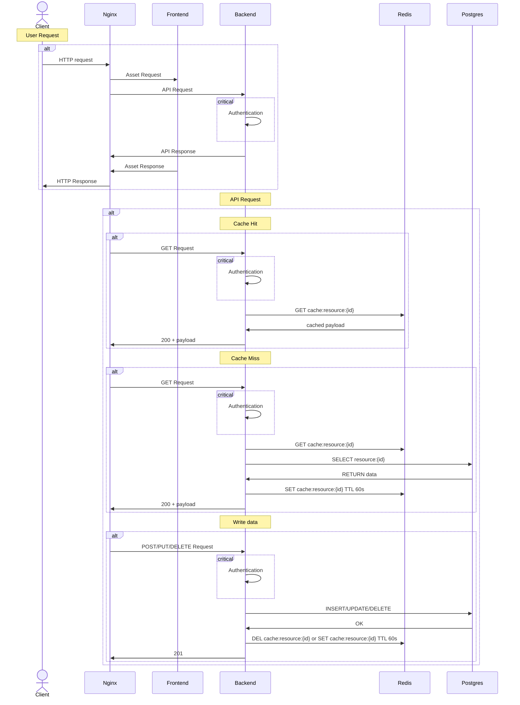

```mermaid
sequenceDiagram
    actor Client
    participant Nginx
    participant Frontend
    participant Backend
    participant Redis
    participant Postgres

    %% User Request (Summary)
    
    note over Client: User Request
    alt  
    Client->>Nginx: HTTP request 
    Nginx->>Frontend: Asset Request
    Nginx->>Backend: API Request
    critical
    Backend->>Backend: Authentication
    end
    Backend->>Nginx: API Response
    Frontend->>Nginx: Asset Response
    Nginx->>Client: HTTP Response
    end

    %% API Request: Cache Hit
    note over Backend: API Request
    alt
    note over Backend: Cache Hit
    alt
    
    Nginx->>Backend: GET Request
    critical
    Backend->>Backend: Authentication
    end
    Backend->>Redis: GET cache:resource:{id}
    Redis->>Backend: cached payload
    Backend->>Nginx: 200 + payload
    end
    %% API Request: Cache Miss
    note over Backend: Cache Miss
    alt
    Nginx->>Backend: GET Request
    critical
    Backend->>Backend: Authentication
    end
    Backend->>Redis: GET cache:resource:{id}
    Backend->>Postgres: SELECT resource:{id}
    Postgres->>Backend: RETURN data
    Backend->>Redis: SET cache:resource:{id} TTL 60s
    Backend->>Nginx: 200 + payload
    end
    %% API Request: Write data
    note over Backend: Write data
    alt
    Nginx->>Backend: POST/PUT/DELETE Request
    critical
    Backend->>Backend: Authentication
    end
    Backend->>Postgres: INSERT/UPDATE/DELETE
    Postgres->>Backend: OK
    Backend->>Redis: DEL cache:resource:{id} or SET cache:resource:{id} TTL 60s
    Backend->>Nginx: 201    
    end
    end

```